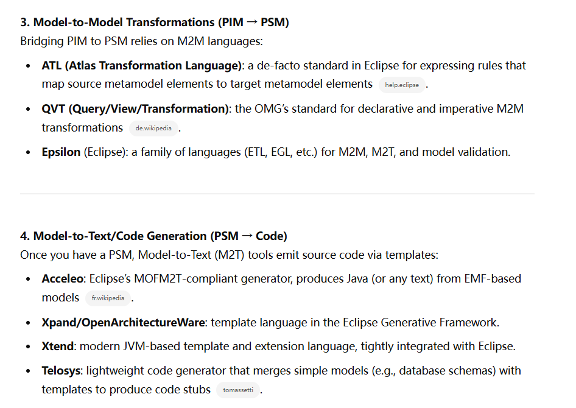
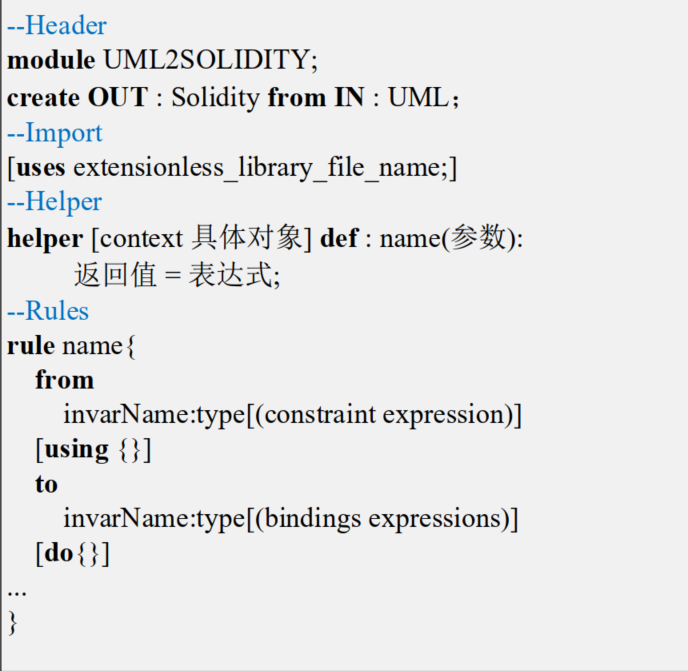

4.9

1. from www.omg.org: （1.5）
   1. about MDA:宗旨是为了应对快速变化的平台和环境，保留企业最重要的business functionality and behavior，这部分投资是企业最重要的也是比较稳定的。而OMG这个组织已经提出很多标准，比如UML（设计、分析软件系统）、XML（存储、传输结构化数据）、COMBA（允许不同语言构建的平台进行通信），而实现MDA这个标准恰恰用了之前已经提出过的标准。通过MAD设计标准，使得企业快速适应新技术、新环境。
   2. 启发：突然明白为什么指南上会要求使用MDA，这些工作是保留整个业务逻辑的工作
   3. 下一步： 通过简单案例了解整个开发过程，并了解其中的工具链怎么使用

4.10

1. 读《解析MDA》4-6章（2）：一个早餐订购系统如何使用MDA开发
   1. 开始构建的PIM非常简略
   2. 后面的PSM有关系模型的、有EJB模型的和web模型的，变换规则涉及了一些知识
   3. 生成代码更是涉及变换规则，应该有自动化工具，但是没看到书上提
   4. 问题：每个不同项目的转换需要自己去制定规则吗
5. 下一步：还是看1-3章，对UML等等建模语言先学习一下

4.14（3.5）

屈学弟目前在做的是CIM（用例）->PIM（序列）的转化和验证（毕设题目），现阶段已经做完转换，并且能生成PIM到MSVL的中间件AST了，下一步是提取性质验证。对于我这边的工作，可以做**元模型定义**，这是一种层次之间转换的方法，虽然MDA每个层用什么表示需要了解广泛一点再看转换，但是我发现可以直接看转换的输入输出来看表示。

## 元模型定义

### 《解析MDA》

1. 变换需要的特性：
   1. 可调
   2. 可追溯
   3. 增量一致：加了新的信息，重新生成的时候旧的信息生成和以前一样
   4. 双向性

2. MOF（Meta Object Facility)四层元模型：定义建模语言来建模
   1. M3：元元模型
   2. M2：元模型：UML的Class、Attribute等的定义
   3. M1：UML
   4. M0：现实世界实例

3. 变换规则定义：

   1. 像是一种编程语言那样的语法，还没理解如何和元模型去联系
   2. **4.15**不太懂，而且也仅仅看到了类的变换，还没有操作。 **变换定义语言**可关注。（2）

   

### GPT对于one-click full system的观点

目前不可能。对于一些structual code(classes, CRUD methods, data schemas数据模式)可以生成。

对于behavioral logic(complex algorithm, workflows, validations)目前还是需要手动编码。

想法：对于类、部分SQL代码，可以直接沿用现在的技术，把重点放在结合大模型上，因为只有大模型才能生成复杂逻辑。

GPT提到的工具：

### 基于模型驱动框架的 Solidity代码生成研究  王梓 西南交通大学 硕士论文

#### 国内外研究现状

基于业务流程、UML、FSM、其他方法。

总结：缺乏由高阶抽象到具体实现的多层次的开发流程，转换跨度过大  ，自动化程度低。(1)

#### 技术路线

1. **4.16**重点关注PIM->PSM的技术内容：
   1. 把最终执行代码的语言特性整合到PIM元模型中
   2. 对比分析 PIM元模型和 PSM 元模型，设计模型间的转换规则  
   3. 使用ATl实现基于元模型的PIM->PSM转换
2. 重点关注PSM->Solidity代码的过程：
   1. 依据 PSM 元模型及转换需求编写了 Acceleo 的模板文件 ，输入转换工具后生成（需要人工微调）

#### 相关技术介绍

1. 2.1.2PIM到PSM转换介绍有相关论文（模板解析方法，还有直接从PIM的UML直接到代码的）
2. 2.1.3模型转换方法:元模型最主流，也是MDA规范方法（3）
3. 2.2有MDA相关规范，如XMI（统一文件格式）、OCL、QVT（模型转换规则标准）-- ATL（以QVT标准开发的语言）等等，后面看了具体的操作再回来看

#### 业务模型建模与转换（仅有伪代码）

1. 每层使用的UML图
   1. CIM -- 用例图 -- 系统功能需求
   2. ＰＩＭ -- 类图和状态机图（静态和动态） --  功能需求和行为
2. 用例图光有图不行，还要有用例描述。自然语言，使用固定句式
3. 类图：
   1. 类之间的关系含义：
      1. 关联：长期的结构关系，如互为成员变量
      2. 依赖：临时使用，如方法参数
      3. 聚合：整体和部分独立存在，如学校和学生
      4. 泛化：继承关系
      5. 实现：类实现接口的功能
4. 用例->类图（自动化后调整）：（考虑什么可以成为类，类之间的关系又如何？）
   1. 用户--类， 用例--类
   2. 关联关系--类关联；泛化关系--继承
   3. 再分析用例描述，动词分析->类的方法，名词分析->类名和属性等等。算法能做到大部分的类的构建，但是一些方法的参数、类之间的关系还需要人工补充。
5. 用例描述->状态图（没说最后需不需要调整）：
   1. 还是分析自然语言，并且有循环、条件的使用，还结合了智能合约的特点来设置trigger,guard,action等等（3）

#### 设计模型转换与代码生成  

怎么定义DSL？几种图的元模型怎么看？

**4.18**

1. 类图的元模型，在UML元模型的基础上，增加了适配solidity的构造型。比如：在 UML 的数据类型中并未直接提供映射的功能，因此需要增加map类型与 Solidity 中的mapping 类型构成对应关系  
2. 补充看元模型图知识：（这个表示和UML类图有些微区别在箭头上）（2）
   1. 箭头：（原文有歧义，实心空心都说是继承）（高亮部分）
      1. 空心箭头：继承，箭头指向父类
      2. 实心箭头：箭头指向被关联的类
   2. 菱形：
      1. 实心菱形：聚合：整体与部分，部分可独立存在，比如人和人的衣服的关系
      2. 空心菱形：组合：整体与部分，但是部分不能独立存在，比如人和人的头
   3. 数字关系：
      1. **`0..\*`**：零到无限多个（例如 `Parameter` 与 `Operation` 的关系，一个操作可以有多个参数）。
      2. **`1`**：必须有且仅有一个（如 `specific 1.1` 表示子类必须继承一个父类）。
      3. **`0..1`**：零或一个（如 `0..1 Nesting` 表示嵌套的类可有可无）。
      4. **`1..\*`**：至少一个
   4. Solidity的元模型设计没有说为什么，只是说了都有哪些。 直观感觉就是，元模型的设计就是要把目标语言的语言特性考虑好，有什么就加什么，**就是把目标语言的语言特性使用元模型表达出来**
   5. ATl转换规则基本结构：
      1. 例子不明不白，但是规则都是能看懂的
   6. PSM->Solidity：（2.5）
      1. 使用Acceleo工具，使用基于模板的方法
>>>>>>> c24dd54489d9e5ce1f135d8fc833cac42e77d1c1
