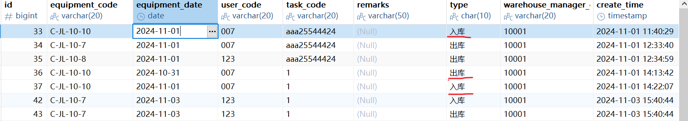

# 工作记录

## 数据库设计阶段（辅助）

2024.6.20 数据库设计v1讨论（1）

2024.6.22 数据库设计v2讨论

## 需求阅读与项目交接

### 需求阅读

1. 4种角色，具体操作看需求表
2. 解决疑问（2）
3. 新交流文档阅读、问题提出（1.5）

### ssm项目系统学习

10.10**前端**

1. 框架理解：约定了什么目录写什么，还有一些功能封装，甚至本来就是完整系统或者是最简系统，只需要稍微修改
2. 前端项目配置文件：package.jason，可以使用npm install来下载依赖，都在node_module里面。类比maven
3. 前端项目结构：
4. 前端配置中vue.configue中的proxy,把dev-api的请求转到了Localhost：8800，但是浏览器中还是显示的原来的请求，通过返回内容区分就行，所以浏览器的请求参考意义不大，不仅配置可以改，后面的nginx配置也可以改（1.5）
5. 路由仅一个文件，就是左边的折叠部分，点击路由就会到相应的页面
6. 在views文件夹中定义页面用vue写，里面的固定结构需要注意，分为前端组件和script代码，其中script代码中需要定义数据、方法、渲染前执行函数，调用方法内的数据、方法前面需要加this.。且调用完api的方法后成功执行then(),失败执行catch()(1)
7. element-ui做到的事情比较多，很多都是代码中看不出来，并且反直觉以及反编码习惯的，所以不知道有什么行为直接GPT。举个例子，组件中绑定的分页，在页码改变的时候，有`@changedPage = "fetchdata"`,其中fetchdata不加括号也不用写参数，ui自动传入改变的页码
8. element-ui学习过的组件汇总：表格（包括分页）（复选框）、查询（输入框、按钮）、表单（输入内容会绑定一个对象值）（表单以及loading以及提示框这些都是通过一个变量的true OR false 来实现弹出和消失）（数据回显得查数据库，防止别人在那段时间改过数据库）（2）

10.10**后端**

1. service 层和mapping层都能CRUD操作，但其实是mp在service层中进行了封装，实际上还是mapping层在进行操作。而且我也理解了为什么需要代码生成器了，就是写个接口，写个继承，没有具体代码，具体代码都在mp中已经通过泛型写好了
2. wrapper（包装）有条件构造器实现
3. 分页查询中使用了自定义的mapper，不是很懂，以后用到再看[21-角色管理模块-CURD接口（条件分页查询下）_哔哩哔哩_bilibili](https://www.bilibili.com/video/BV1ad4y1y7LU?p=21&spm_id_from=pageDriver&vd_source=5e7683ae86506a8ecc7c5af8d116112e)。查看官网后发现，Vo像是一个条件（2）10.11回看：Vo是对实体类的部分封装，这样可以不用暴露太多的字段，传值比较方便

10.11

1. 用户权限分配小结：就是简单的CRUD以及前端表格、弹窗的制作。前端ElememntUI有意想不到的性质，使用前可以先查查都是什么意思，功能已经非常强大，无需自己再去想底层的东西
2. JWT为了生成token并且加密、解密，当成一个工具类即可（2）
3. 用户分配菜单实现还是通过路由的改变来实现的，具体来说，登录时存储了用户的信息发送token到后端，进行查询得出该用户的权限，通过构造出前端的routers数据（**树型构造**）返回来改变。树形构造的片应该是漏了，没能找到（2）

### 项目交接

#### 环境配置

10.14

1. 后端、前端开发工具安装
2. git集成（2）

10.15

1. npm镜像配置后安装前端依赖。前端项目运行（1）
2. 配置数据库、redis[win 10 系统下启动Redis和判断Redis是否启动 - 没睡好 - 博客园 (cnblogs.com)](https://www.cnblogs.com/CAOZANDING/p/15342946.html)。以后记得，运行项目需要打开数据库和redis服务器。后端项目运行。
3. 403Forbidden解决：redis服务器没有打开。关闭cmd会导致服务器关闭，而且在“服务”中没有redis服务起运行信息，关注后端报错（1）

#### 项目阅读尝试

10.16

1. 讨论数据库表（1）

2. 角色管理页面：（1.5）

   1. 后端利用page对象来进行查询所有，拥有分页控制
   2. 参数的绑定，有pathParam， RequstParam， RequestBody三种，注意顺序，名字

3. 数据库索引复习：[MySQL索引从基础到原理，看这一篇就够了-阿里云开发者社区 (aliyun.com)](https://developer.aliyun.com/article/841106)（1）

   1. 索引存储方式两种：聚簇（索引、数据存一起）与非聚簇，对应两个不同的存储引擎。
   2. 数据结构：B+树。优点：对于千万级数据磁盘IO次数稳定；排序能力强（叶子节点之间形成有序链表）
   3. 主键、外键、唯一值是自动创建索引的
   4. 什么时候用什么索引（还需要继续看）

4. 讨论数据库（1.5）

5. ```java
   // 分页查询的一些疑惑：（1）
   //创建page对象
   Page<SysEquipmentUse> pageParam = new Page<>(page,limit);
   //调用service方法
   IPage<SysEquipmentUse> pageModel = sysEquipmentUseService.equipmentUsageDays(pageParam,sysEquipmentUsageDaysQueryVo);
   
   // Page类用来放条件，它是IPage的实现
   // IPage<T>返回是灵活处理，实际上返回的是一个Ipage的实现类，即参数中的Page
   // Mybatis自动帮我们做好了这个事情，在sql语句查询到多行数据后，会把一行数据通过resultMap对应到其类型，在这里就是SysEquipmentUse，然后把多行数据的list放入Page对象进行返回
   ```

6. xml文件中不用管开头sql以上的语句，为自动生成（0.5）

7. ```javascript
   <el-input style="width: 100%" v-model="searchObj.keyword" placeholder="角色名称/角色编码/角色描述"></el-input>
   // v-model是双向绑定的，输入框改变，则变量改变，如果有回显，变量改变，输入框也改变
   // placehodel则是没有输入的时候的默认提示（0.5）
   ```

   

10.17

1. 权限管理视频回看（1）
   1. login 请求返回 token, 再次发info请求，此时请求头带上了token值。后端由token得到用户名从而得到菜单和按钮权限
   2. 由MenuHelper和RouterHelper使得router返回为动态的
   3. 前端改动的太多，也没有说为什么，暂时先不管[92-权限管理模块-权限管理前端整合_哔哩哔哩_bilibili](https://www.bilibili.com/video/BV1ad4y1y7LU?spm_id_from=333.788.videopod.episodes&vd_source=5e7683ae86506a8ecc7c5af8d116112e&p=92)（0.5）

2. 数据库中的内外连接复习：（1）

   1. 内： 取交集

   2. 外： 取并集

      1. 左外： 以左表为基础，所以左表即使没有右表的东西也会显示
      2. 右外：以右表为基础
      3. 注意：t1 left join t2， 则t1为主表

   3. 全： 直接全部连接，不管两边有没有相等数据

   4. where 和 join 的关系解析： 有些join能用where解决

      1. 比如：有两张表，想选出员工对应的项目，要求没有项目也要显示，那么必须用连接完成。

         ```sql
         +----+---------+-------+  
         | id | name    | dept  |  
         +----+---------+-------+  
         | 1  | Alice   | HR    |  
         | 2  | Bob     | IT    |  
         | 3  | Charlie | IT    |  
         | 4  | David   | Sales |  
         +----+---------+-------+  
         
         +----+---------+---------+  
         | id | project  | emp_id  |  
         +----+---------+---------+  
         | 1  | Alpha    | 1       |  
         | 2  | Beta     | 2       |  
         | 3  | Gamma    | NULL    |  
         | 4  | Delta    | 3       |  
         +----+---------+---------+
         
         ```

         

3. git讨论（0.5）
4. 组会（0.5）


## 项目开展

### TodoList（0.5）

- [ ] 17 自动插入一段时间的记录的功能，记录补充员有此权限。输入相关信息以及日期范围，自动插入一段日期范围内每天的检测记录。设备使用记录同理。（注意，需要设定“是否补充记录”为是 ），供补充外包记录的时候使用。【前后端修改】
- [ ] 18 添加新的查询功能
  - [x] 18.1根据任务查询所有检测人员名单、使用过的设备名单（包括真和假记录）。权限：开放给所有检测人员。【前后端修改】
  - [x] 18.2、根据用户工号查询在一段时间内，经历的任务数、检测记录填写天数（仅包括真的记录）。权限：开放给所有检测人员（指定本人工号），管理人员可输入工号。【前后端修改】
  - [x] 18.3、给出人员出勤汇总表，查询一段时间内，所有员工的工号、经历的任务数、检测记录填写天数（仅包括真的记录）。权限：仅管理人员【前后端修改】
  - [x] 18.4、根据设备，查询一段时间内，设备的使用天数。（包括真和假的记录）供设备送检校正使用。【前后端修改】
  - [x] 18.5 空闲人员只查找普通检测人员，现在后端分开查找了
  - [x] 18.6 “任务所使用设备查询” 做成18.1

### 具体实现记录

10.18

#### 18.1实现

1. 确定表格：sys_detection(没有使用设备的检测人员)  sys_equipment_use(在某任务下使用了设备的检测人员)
2. 前端表现形式：
   1. 所有检测人员，包含使用设备的、目测的，都有真假标签，没有使用设备那就是空
3. 后端需要的数据：
   1. sys_detection和sys_equipment_use中查出所有人员的信息形成表格1
4. 尝试连表失败，转用视图（2.5）
5. 构建视图加测试（1.5）
6. 代码生成（1）
7. 编写后端接口（2）
8. 排查 Autowire 错误（2）
9. 修改视图，编写前端（1）
10. git冲突解决（1）


10.21

1. 记录下原本的视图（view_task_user_equip_query），防止修改后发生错误

1. 修改视图，增加任务起止时间列。最后记得修改model内的实体类

2. 丢弃以上方案，直接在xml文件中连接视图和真实表进行查询即可（1），编写查询如下：

   ```sql
   SELECT   
       v.user_name,  
       v.employee_code,  
       v.task_code,  
       t.start_date,  
       t.end_date  
   FROM `view_task_user_equip_query` v 
   JOIN  
       sys_task t ON v.task_code = t.task_code
   WHERE v.is_additional = 0;
   ```

3. 讨论后发现数据库发生修改，现在可直接查询一个表：sys——detection，以上查询必须重写（1）

4. 修改18.1（1）

   1. 一个表显示： 设备名称、设备编号、项目编号、是否补充

      1. 创建实体类在vo

      2. 编写sql语句和xml文件

         ```xml
         <resultMap id="DeviceMap" type="com.equipment.model.vo.FindEquipByTaskCode" ></resultMap>
             <select id="SearchEquipByTask" resultMap="DeviceMap">
                 SELECT DISTINCT  e.equipment_name,e.equipment_code,u.task_code, u.is_additional
                 FROM sys_equipment_use u
                 JOIN sys_equipment e on u.equipment_code = e.equipment_code
                 <where>
                     <if test="sysTaskDeviceQuery.keyword != null and sysTaskDeviceQuery.keyword != ''">
                         AND u.is_deleted = 0 and u.task_code = #{sysTaskDeviceQuery.keyword}
                     </if>
                 </where>
             </select>
         ```

         

      3. 创建新的后端函数，在已有controller下写

      4. 前端路由：js文件（1.5）

   2. 一个表显示：用户姓名、用户ID、项目编号、是否补充

      1. 编写查询语句：承接的实体类就用之前的视图实体类，在resultmap里面规定下对应的列即可（0.5）

         ```sql
         # 后续需要再加上where条件，根据任务id
         SELECT DISTINCT u.user_name, u.user_code, d.task_code, d.is_additional
         FROM sys_detection d , sys_user u 
         where d.employee_code = u.user_code
         AND d.is_deleted = 0;
         ```

         ```xml
         <resultMap id="ViewTaskUserEquipQueryMap" type="com.equipment.model.view.ViewTaskUserEquipQuery">
                 <result property="userName" column="user_name"/>
                 <result property="employeeCode" column="user_code"/>
                 <result property="taskCode" column="task_code"/>
                 <result property="isAdditional" column="is_additional"/>
             </resultMap>
             <select id="SearchUserDeviceByTaskcode" resultMap="ViewTaskUserEquipQueryMap">
                 SELECT DISTINCT u.user_name, u.user_code, d.task_code, d.is_additional
                 FROM sys_detection d
                 JOIN sys_user u ON d.employee_code = u.user_code
                 <where>
                     <if test="sysTaskDeviceQuery.keyword != null and sysTaskDeviceQuery.keyword != ''">
                         AND d.is_deleted = 0 and d.task_code = #{sysTaskDeviceQuery.keyword}
                     </if>
                 </where>
             </select>
         ```


#### 18.2实现

1. 前端显示数据有： 用户姓名、用户ID、任务编号、打卡时间，经历任务数另外显示，检测记录填写天数另外显示。

2. 考虑：经历任务数、检测记录填写天数能否用group by做到（1）

   1. 检测记录数就是总共的数据

   2. 经历的任务数可以**group by** task_code得出

   3. 不用list在后端处理是因为要返回一个page的，试试前端处理

      ```javascript
      var uniqueTask = new Set(response.data.records.map(record => record.taskCode));  
      this.taskNum = uniqueTask.size;
      ```

3. 后端代码：

   1. 实体类编写。丢弃，因为有视图了，且有实体类
   2. 后端接口，编写在SysDetectionController中，逻辑写在了controller里面，在service里面可能要注入mapper,不确定。（1.5）

4. 前端：使用equipDetection.js写路由，新建list.vue写前端页面，并在菜单管理添加新的页面(3)10.23

   1. 增加日期选择查询：起始日期、结束日期

   2. 将日期选择后的变量传到关键字中

      1. v-model绑定了value2,虽然value2是空字符串，但是会进行类型转换，最后变成[date1,date2]
      2. 不会的vue行为一定要查，这谁想得到

   3. 注释要加在vo里面，不然没有那些get函数

      ```java
      import lombok.Data; //！！！！！！！！！！！！！！！
      
      @Data // ！！！！！！！！！！
      public class UserIDAndDateRageVo {
          private static final long serialVersionUID = 1L;
      
          /**
           * 查询关键字
           */
          private String keyword;
      
          /**
           * 任务开始时间
           */
          private List<Date> dateRage;
      }
      ```

   4. 日期之间构造wrapper

      ```java
      List<Date> dateRage = sysTaskDeviceQueryVo.getDateRage();
              if (dateRage != null && dateRage.size() == 2) { // 确保 dateRage 不为 null 且包含两个日期
                  Date startDate = dateRage.get(0);
                  Date endDate = dateRage.get(1);
                  r.between("startDate", startDate, endDate); // 生成日期范围查询条件
              }
      ```

   5. bug:invalid character found in the request target （3）

      1. 怀疑是传递列表的问题。后： url里面不能传递如[]的符号。

         1. 处理方法：拿到value2列表后手动赋值start 和 end到searchObj里面
         2. 进而更改vo类

      2. 又出现日期格式无法处理的问题：

         1. 更改成string，不行

         2. 更改成string，且用format-data属性指定成yy-mm-dd，还是不行

         3. 在后端进行格式转换，转成date类型，代码如下：

            ```java
            import java.text.SimpleDateFormat;
            import java.text.ParseException;
            // 添加日期范围条件
                    String startDateStr = sysTaskDeviceQueryVo.getStart();
                    String endDateStr = sysTaskDeviceQueryVo.getEnd();
                    // 定义日期格式
                    SimpleDateFormat dateFormat = new SimpleDateFormat("yyyy-MM-dd"); // 根据您的日期格式进行调整
                    try {
                        if (startDateStr != null && endDateStr != null) {
                            // 将字符串转换为日期
                            Date startDate = dateFormat.parse(startDateStr); //一定要处理exception，不然无法使用
                            Date endDate = dateFormat.parse(endDateStr);
            
                            // 生成日期范围查询条件
                            r.between("start_date", startDate, endDate);
                        }
                    } catch (ParseException e) {
                        e.printStackTrace(); // 处理解析异常
                    }
            ```

      3. 总结：看了下之前写过的处理日期的代码，在前端获取到日期确实要分开来传给searchObj,后端自己写的xml可以不用类型转换，但是如果使用封装函数，就需要类型转换

   6. 统计信息bug：不显示（1）最后使用文字（1.5）

      1. 查博客与官方文档：2.15.11版本才加入了statistic组件
      2. 由于更改版本涉及其他组件的可用性，还是放弃使用，需要考虑是否美化？

#### 18.3实现

10.24

1. 前端显示：检测人员姓名、工号、经历任务数、检测记录填写天数

2. 后端：

   1. sql语句编写

      ```sql
      SELECT d.employee_name, d.employee_code, COUNT(DISTINCT d.task_code) as task_num, COUNT(d.task_code) as detection_num 
      FROM view_detection_name_query d
      GROUP BY d.employee_name , d.employee_code;
      ```

   2. 实体类编写

   3. 接口编写，xml编写。group by放在where后面，一般条件和if标签要用and连接（3）

      ```xml
      SELECT d.employee_name, d.employee_code, COUNT(DISTINCT d.task_code) as task_num, COUNT(d.task_code) as detection_num
              FROM view_detection_name_query d
              <where>
                  <if test="taskAndDetectionVo.keyword != null and taskAndDetectionVo.keyword != ''">
                      and (d.employee_code = #{taskAndDetectionVo.keyword})
                  </if>
                  <if test="taskAndDetectionVo.start != null and taskAndDetectionVo.start != ''">
                      and (d.start_date >= #{taskAndDetectionVo.start})
                  </if>
                  <if test="taskAndDetectionVo.end != null and taskAndDetectionVo.end != ''">
                      and (d.start_date &lt;=  #{taskAndDetectionVo.end})
                  </if>
                  and d.is_deleted = 0
                  and d.is_additional = 0
              </where>
              GROUP BY d.employee_name , d.employee_code
      ```

   4. 解决返回任务数和打卡天数为0的bug:（2）

      1. 检查语法，发现navicat执行正确
      2. 检查xml语法，测试还是为0
      3. 检查后端代码，是否实体类没有使用返回的类型，但是偶然发现后端返回的数据是正确的，只能是映射到实体类出的错
      4. 检查实体类的类型：string不行，long不行
      5. 最后，把实体类的task_Count 改成了task_num,发现成功，说明在自动映射的情况下，最好和select出来的同名，或者就是下划线的区别不然找不到地方映射

   5. 组会加完善18.2（2）

10.25

#### 18.4实现（3）

1. 前端显示：设备名称、设备编号、使用天数

2. 后端代码编写：

   1. 实体类创建

   2. 查询条件实体类就使用`UserIDAndDateRageVo`，这里注意，下次命名Vo类可以通用点，不用把这个使用到的功能体现在名字上

   3. 后端接口：编写xml文件吧，省去了类型转换以及wrapper构造是否能count的麻烦

      1. controller使用`SysEquipmentController.java`

      2. xml代码：

         ```xml
         <resultMap id="EquipmentUseDaysCountMap" type="com.equipment.model.vo.EquipmentUseDayCount"></resultMap>
             <select id="EquipmentUseDaysCount_Mapper" resultMap="EquipmentUseDaysCountMap">
                 SELECT e.equipment_use_name as equipmentName, e.employee_use_code as equipmentCode, COUNT(DISTINCT e.equipment_use_date) AS useDayCount
                 FROM view_use_name_query e
                 <where>
                     e.is_deleted = 0
                     <if test="CountEquipmentUseDaysVo.keyword != null and CountEquipmentUseDaysVo.keyword != ''">
                         and (e.employee_use_code = #{CountEquipmentUseDaysVo.keyword})
                     </if>
                     <if test="CountEquipmentUseDaysVo.start != null and CountEquipmentUseDaysVo.start != ''">
                         and (e.equipment_use_date >= #{CountEquipmentUseDaysVo.start})
                     </if>
                     <if test="CountEquipmentUseDaysVo.end != null and CountEquipmentUseDaysVo.end != ''">
                         and (e.equipment_use_date &lt;= #{CountEquipmentUseDaysVo.end})
                     </if>
                 </where>
                 GROUP BY e.equipment_use_name, e.employee_use_code
             </select>
         ```

   4. 前端代码编写

      1. 页面生成，可以使用 “查询员工一段时间内的任务和打卡数统计boss版”
      2. js文件引入

#### 16修改（3）

1. 前端显示：员工姓名，员工编号

2. xml 修改：注意，detection视图需要和user表连接，否则会有新人查不到，现在是以user表为主

   ```xml
   <resultMap id="SysDetectionMap" type="com.equipment.model.system.SysUser"  autoMapping="true"></resultMap>
   
       <select id="sysDetectionEmployeesMap" resultMap="SysDetectionMap" >
           SELECT DISTINCT u.user_name as userName, u.user_code as userCode
           FROM sys_detection d
           RIGHT JOIN sys_user u on u.user_code = d.employee_code
           <where>
                u.is_deleted = 0
               <if test="detVo.startTime != null and detVo.startTime != ''">
                   AND u.create_time &lt;= #{detVo.startTime}
               </if>
           </where>
           AND NOT EXISTS (
           SELECT 1 FROM sys_detection sub
          
           <where>
                  sub.employee_code = d.employee_code and sub.is_deleted = 0
               <if test="detVo.startTime != null and detVo.startTime != ''">
                   AND sub.start_date >= #{detVo.startTime}
               </if>
               <if test="detVo.endTime != null and detVo.endTime != ''">
                   AND sub.start_date &lt;= #{detVo.endTime}
               </if>
           </where>
           )
       </select>
   ```

3. 需要和交控讨论的：做了员工创建的约束，如果员工后面来的不会搜到

10.28

1. 组会、合并数据库并排查bug(1)

10.29

1. 待沟通（1.5）
   1. 所有的表的主键约束现在仅有id, 需要在原来的主键约束中加入unique约束，如设备编号
   2. 设备使用等表的外键约束
   3. 出入库合法问题是否在数据库中判断，包括6，7
   4. 使用表，交接表合法性
   5. 数据约束9 中的需要做的

#### 数据库约束实现

10.30

1. 基础表加unique：(0.5)

   1. sys_user中user_code设置了unique, 防止由于user_code不是主键而重复加入同一员工
   2. sys_role中role_code设置了unique, 防止由于role_code不是主键而重复加入同一角色
   3. sys_equipment，equipment_code设置了unique, 防止由于equipment_code不是主键而重复加入同一设备
   4.  sys_task，防止由于task_code不是主键而加入同一任务 

2. 联合表加外键约束：（Unique在sql中允许多个null,因此需要指定不为null）(1)

   1. sys_user_role: role_id 和 user_id关联 role和user表的id, 删除策略为cascade, 因为想删除role就是想把这个角色的内容全部删除，想删除一个用户，则他分配的角色也全部删除。做好误删的前端确认。把数据都删除了，才加上的约束。

3. **沟通结果： sys_menu, sys_role_menu, sys_user_role不加约束**，把所有表加上is_unique字段(0.5)

4. 给需要逻辑删除的表添加虚拟列 is_unique:

   ```sql
   `is_unique`  tinyint UNSIGNED GENERATED ALWAYS AS (if((`is_deleted` = 1), NULL,1)) VIRTUAL COMMENT '是否需要唯一性约束' NULL,
   UNIQUE INDEX `uk_code_is_unique`(`code` ASC, `is_unique` ASC) COMMENT '角色代号唯一（逻辑删除的不进行约束）'
   ```

   - [x] sys_detection
   - [x] sys_equipment **10.31**
   - [x] sys_equipment_maintenance
   - [x] sys_equipment_stock
   - [x] sys_equipment_transfer
   - [x] sys_equipment_use
   - [ ] sys_role 需要吗？？
   - [x] sys_task
   - [x] sys_user

5. 唯一性约束：唯一性索引

   - [x] sys_user: code 和 is_unique
   - [x] sys_task: code 和 is_unique
   - [x] sys_equipment: code 和 is_unique

   发现，其他表无需唯一性索引了。**待讨论**:检测表、设备使用、交接、出入库、保养表需不需要约束相同的记录（时间不相同，但是其他相同），总之无法使用is_unique来约束，需要触发器或者别的

6. 外键约束：主要是检测表、设备使用、交接、出入库、保养表，关联员工编号、任务编号、设备编号。 navicate有个奇怪的问题，外键名称不能重复，不同表不行
   1. 检测表：
      1. em_code: 删除时 no action(自动转换成restrict,不让删除，但是其实都是逻辑删除，不存在触发问题), 更新时cascade
      2. task_code:同上
      3. **detectionLoc 和 task表里面的location需要一致吗？**
   2. 设备使用：
      1. em_code
      2. eq_code
      3. task_code
   3. 设备交接
   4. 设备出入库
   5. +设备保养（1.5）
7. 讨论新版数据库约束v4（1）
8. 做到第8（2）
   1. 触发器的语法坑：获得插入的新数据应该是NEW.xxx
9. 组会加继续做（1.5）

11.1 

1. 出入库表的出入库序列触发器（1）
   1. 坑：NEW获得新的数据，OLD获得没更新的数据。因此，有时候插入和更新不一样，需要辨别
2. 使用表 （1）
   1. 判断是否最近出库 触发器
   2. 判断任务地点是否正确 触发器
3. bug修改：（0.5）
   1. 出入库中，有记录 但是入库会出现异常的逻辑问题
   2. 设备使用判断最近是否出入库，加入时间范围，限定是当前时间节点以前，考虑补充记录问题
4. 交接表（2.5）
   1. 自动生成出入库插入时
   2. 自动生成出入库更新时
      1. 需要删除原来的记录，之前没有因为触发器而新增的记录

11.3 （1.5）

#### 数据库测试问题

1. 出入库中，inOutCheck更新的问题：更新33的类型为入库，错误的成功

   更新时，需要查找更新后的时间节点以前最近的一条记录：

   ```sql
   -- 根据设备编号查找最近一条记录的时间  
   SELECT MAX(s.equipment_date) 
   INTO max_date  
   FROM sys_equipment_stock s
   WHERE s.equipment_code = NEW.equipment_code AND s.equipment_date < NEW.equipment_date;  
   -- 原本就有，因此要小于
   ```

   由于条件是**小于**， 导致当天的入库记录没有查出来，查出来的是出库记录，因此错误判断更新的入库合法。

2. 交接表中，afterTransfer更新问题：程序无法知道之前的入库是不是由已经有的更改过来的，如上图的42，43。比如说要改个交接员，是要删除这两条记录重写的，那么这个入库记录无法判断是交接前入库的，还是交接后自动填写的入库。

   is_transfer这个字段本来可以判别，但是需求中要求了如果有入库记录，要把入库的记录也改成虚拟的。

   因此也还没有写删除时的触发器更新


入库和出库约束讨论，前提：仅考虑正常的插入。

入库：

查询最近一条记录，查询其所在日期的所有出入库记录，查询是否存在同一任务单号的出库，如果有，可以插入。

出库：

查询最近一条记录，查询其所在日期的所有出入库记录，对出库记录通过任务单号一一匹配入库记录，如果不存在未匹配的出库记录，则可以插入。


11.4

1. 讨论上一版数据库问题，确定新方案（2）
2. 实现新版的触发器2个（2）
3. 组会讨论（1.5）

#### 更改触发器后测试：（4）

1. 出入库表：

   1. 能实现当天的同一设备不同任务的出入库。插入

2. 交接表：

   1. 旧任务有入库的情况下的交接， 插入， 例子10
      1. 更新新任务编号（和判断最近入库有冲突，因为会搜到当天自己入库，已解决）
      2. 更新 旧任务编号: 对于更新来说，在设备号、旧任务号、交界地都填错的情况下，还要再删一条，不然插不进去
      3. 接收人更改
   2. 旧任务在没有入库的情况下交接，并且在同一天，插入,例子8（2）
      1. 更新 新任务编号
      2. 更新 旧任务编号（只能是设备号和旧任务号一起填错了）
         1. 交接表判断最近是否出库的s.id<>id在id=NULL的时候始终返回false，会过滤掉所有的记录
      3. 接收人更改

3. 使用表

   1. 出入库都在同一天的插入，更新

   

```sql
USE [gongjiao1116]
GO

/****** Object:  StoredProcedure [dbo].[xiugaizdz]    Script Date: 2024/11/5 22:57:26 ******/
SET ANSI_NULLS ON
GO

SET QUOTED_IDENTIFIER ON
GO

create procedure [dbo].[xiugaizdz] 
    @sjk nvarchar(32),
    @zd nvarchar(32),
    @lz nvarchar(32),
    @xz nvarchar(32)
as
    declare @sql nvarchar(2000)
    --声明游标：查询包含@zd字段的所有表的名字
    set @sql='  declare bm cursor scroll for
                select name 
                from ' + @sjk + '.dbo.sysobjects' +
             '    where xtype=''U'' and
                    id in (select id from ' + @sjk + '.dbo.syscolumns where name=''' + @zd +''')'
                    
    execute(@sql)
    open bm
    declare @bm nvarchar(32)
    
    --将包含@zd字段的所有表的约束关闭
    fetch next from bm into @bm
    while @@fetch_status=0
        begin
            set @sql = 'alter table ' + @bm + ' nocheck constraint all'
            execute(@sql)
            fetch next from bm into @bm
        end 

    --将包含@zd字段的所有表进行更新：将原来老值@lz全部替换为新值@xz
    fetch first from bm into @bm
    while @@fetch_status=0
        begin
            set @sql = 'update ' + @bm + ' set ' + @zd + '=''' + @xz + ''' where ' + @zd + '=''' + @lz + ''''
            execute(@sql)
            fetch next from bm into @bm
        end 

    --将包含@zd字段的所有表的约束打开
    fetch first from bm into @bm
    while @@fetch_status=0
        begin
            set @sql = 'alter table ' + @bm + ' check constraint all'
            execute(@sql)
            fetch next from bm into @bm
        end 

    close bm
    deallocate bm


GO
```


11.6 

1. 更新全部加上不会选到自己：(id IS NULL OR s.id <> id)
2. 查找全部加上不选 is_deleted(1.5)
3. 加上分页组件、调换页面位置（1）
4. 空闲设备bug解决：（1）
   1. 需求确定： 在选择日期之中，入库、出库怎么确定空闲？还是直接判断有没有使用记录，不关心出入库，而是看是否有检测记录？

11.7 

1. 空闲设备查询：必须指定两头日期，因为使用的 between比较。如果为NULL则where条件过滤，则not exist选不上就会返回所有（2）

   ```sql
   -- 在库设备
   SELECT  *
   from sys_equipment e
   WHERE NOT EXISTS(
           SELECT 1 
           FROM sys_equipment_stock s
           where s.equipment_date BETWEEN '2024-11-17' AND '2024-11-29' AND s.equipment_code = e.equipment_code)
         AND not EXISTS(
           SELECT 1
           FROM sys_equipment_stock s
           WHERE s.equipment_date < '2024-11-17' AND s.type = '出库'
           AND s.equipment_code = e.equipment_code  
           ORDER BY s.equipment_date DESC,   
                  CASE WHEN s.type = '出库' THEN 1 ELSE 0 END  
           LIMIT 1 
         )
         ;
   ```

2. 小问题修改： 地点判断位置放在外面、加上没有使用记录（1.5）

   1. 测试：
      1. 在库的出库的：无使用记录能搜，添加使用记录则搜不了

3. 发现数据库问题： 外键约束没办法约束is_deleted为1的字段。(0.5)

4. 组会讨论加 增加约束 （1.5）

   

11.8 

1. 添加触发器实现外键约束（1）
   1. 交接表、使用表没有检查用户以及任务编号，主要考虑到依赖的出入库表是合法的，否则添加不进去
2. 查看移动端代码，讨论：先把登录弄好，接入自己的数据库，做一个小demo（2）


## 移动端开发

### 前期调研

1. 如歌联通后端JAVA[微信小程序+java springboot后台_小程序和java后台管理页面-CSDN博客](https://blog.csdn.net/xingsfdz/article/details/106933789)1. 加入依赖 2. 配置信息
2. [手把手教你Spring Boot 整合微信小程序实现登录与增删改查-腾讯云开发者社区-腾讯云](https://cloud.tencent.com/developer/article/1629611)小程序联通spring boot 增删改查
3. [java springboot集成微信小程序【详细教程】_springboot微信小程序-CSDN博客](https://blog.csdn.net/A_yonga/article/details/125460547)有几部还是不知道什么意思
4. [史上最详细微信小程序授权登录与后端SprIngBoot交互操作说明！！！附源代码-阿里云开发者社区](https://developer.aliyun.com/article/1412341)登录授权
5. [GitHub - linlinjava/litemall: 又一个小商城。litemall = Spring Boot后端 + Vue管理员前端 + 微信小程序用户前端 + Vue用户移动端](https://github.com/linlinjava/litemall)


11.11

1. 解决无法运行到微信小程序问题：选择的模板是uni-appx，不支持小程序。社区内解决问题（1）
2. scancode接口测试，返回的是html的string（1）
3. 查找解析string的方法（1.5）[Chinese README · cheeriojs/cheerio Wiki · GitHub](https://github.com/cheeriojs/cheerio/wiki/Chinese-README#findselection)
4. 使用cheerio成功解析html string （1.5）
5. 组会（0.5）

11.12

1. 真机能扫码，但是看不到效果
2. 阅读有关分页的代码（1.5）
3. 写分页组件（2.5）
   1. pagination当前页码（用来调用后端，告诉后端需要第几页）和组件内的当前页
   2. 组件的更新事件是change，一开始误认为是update:current,阅读源码后发现是change，update:current只是用来更新当前页
   3. 后端需要的参数是page, limit, 这个组件没能改写limit. 所以其实是后端做了更大的工作
4. git changelist追踪了在ignore文件的文件夹，新建changelist区分（0.5）


11.13

1. 日期选择器（1.5）
   1. 图层控制（1）
   2. 大表单”取消“和”完成“之后，数据的清空。只有完成有函数，取消不清空
   3. 日期默认为当前（0.5）后面看看提交过一次以后，默认会不会清空
   4.  日期格式问题， 属性不起作用。使用字符串处理解决。11.14发现，原来格式约束的是dateSar这个变量
   5. 把日期值传给提交表单对象（0.5）


11.14

1. 城市选择器（2.5）
   1. 图层控制, v-model绑定了citydate和showCity所以，确定、取消都可以自己更新
   2. 大表单”取消“和”完成“之后，数据的清空。 在点击添加按钮后重置
   3. 传递数据给大表单
2. merge讨论、工期预测、任务分工（1）
   1. 扫码集成
   2. 解决地点清空
   3. 首页导航
3. 晚上集成扫码、组会（3）


11.15

1. 扫码失败是微信id问题 [20230420 18:23:25\]_scancode:fail 系统错误,错误码:1-CSDN博客](https://blog.csdn.net/qq_39882537/article/details/130272946)（1）
2. 回显bug可能和响应式、同步异步有关，暂时还没解决（1）


11.18

1. 添加导航页面（2）
2. 添加测试数据，写测试情况、功能说明（2.5）
3. 组会（0.5）


11.19

1. 测试3个模块加文档（1）

# 测试

## 用户

1. 
2. 
3. 

## 功能测试

### 任务参与人员与设备

1. **功能**：通过任务编号（精确查找），在检测表和设备使用表分别查出参与了任务的人员和设备编号
2. **权限**：所有人员可使用
3. **演示**：输入任务编号查看对应的人员与设备是否正确（已测试）
   1. aaa25544424对应设备和人员

### 空闲设备查询

1. **功能**：通过指定时间段（必须有时间可以没有其他）、地点、设备编号，在出入库表和设备使用表中，查找空闲设备
2. **权限**：
3. **演示**：（已测试）
   1. 情况1：时间段内在库（11.15-11.19）
   2. 情况2：时间段内出库但是没有使用记录（11.15-11.19）（C-JL-10-8）
   3. 情况2的条件下再加个地点，要求地点和出库任务所在地点一样才能搜出来（内蒙古自治区 C-JL-10-8）
4. **特别说明**：时间段两边节点当天有出入库不行

### 空闲员工查询

1. **功能**：通过指定时间段，在检测表中，查询时间段内没有检测记录（包括补充记录）的员工
2. 权限：
3. **演示**：（已测试）
   1. 情况1： 123有记录，查不出，007能查出（10.24-10.30）
   2. 情况2： 时间段在007入职之前（7.19-7.20）
4. **特别说明**：
   1. 时间段两边节点当天有检测记录不行
   2. 入职当天不行
   3. 时间段在员工入职前不行

### 单个员工任务和打卡数

1. **功能**：通过指定时间段（可以没有），在检测表中，查询自己在这段时间经历的任务数和打卡记录数（仅包括真实记录）
2. **权限**：每个员工
3. **演示**：（已测试）
   1. 情况1：在日期内的记录统计应正确（admin为例，11.16-11.20，3任务4记录）
   2. 情况2：日期外记录应搜不到

### 所有员工任务和打卡数

1. **功能**：通过指定员工（可以没有）， 指定时间段（可以没有），在检测表中，查询各员工在这段时间经历的任务数和打卡记录数（仅包括真实记录）
2. **权限**：管理人员
3. **演示**：同上（已测试）

### 设备使用天数查询

1. **功能**：通过指定设备编号（可以没有）， 指定时间段（可以没有），在设备使用表中，查询统计设备在该时间段的使用天数
2. 权限
3. 演示：（已测试）
   1. C-JL-10-7为例，在时间段内，11.1-11.5可以正确查询（带不带设备编号都行）


11.20 

1. 交控沟通交流（5）

11.21

1. 组会（0.5）


11.22

1. 人员任务数与记录数统计把没有记录的人带上

   1. xml(2) 

      ```xml
      SELECT u.user_name as employee_name, u.user_code as employee_code, COUNT(DISTINCT d.task_code) as task_num, COUNT(d.task_code) as detection_num
      FROM view_detection_name_query d
      RIGHT JOIN sys_user u on d.employee_code = u.user_code
      <where>
          u.is_deleted = 0 AND (d.is_deleted is NULL OR d.is_deleted = 0) 
          <if test="taskAndDetectionVo.keyword != null and taskAndDetectionVo.keyword != ''">
              and (u.user_code = #{taskAndDetectionVo.keyword})
          </if>
          <if test="taskAndDetectionVo.start != null and taskAndDetectionVo.start != ''">
              and (d.start_date >= #{taskAndDetectionVo.start})
          </if>
          <if test="taskAndDetectionVo.end != null and taskAndDetectionVo.end != ''">
              and (d.start_date &lt;=  #{taskAndDetectionVo.end})
          </if>
      </where>
      GROUP BY u.user_name , u.user_code
      ORDER BY detection_num DESC
      ```

   2. sql 三值逻辑，true,false,null, null和任何比较都是unknown, 所以有特殊的is null比较

2. 去掉空闲查询页面

3. 登录状态（1）

4. 查找数据库交接表bug（2.5）

   1. 需要解决到底是哪个任务插入的时候有问题（3）
   2. 原因：在更新触发器执行到最后一步的时候，即插入新任务的入库，是11-30。插入前触发器判断之前是否有入库，由于之前为了同一天出入库，而设置的s.equipment_date <= NEW. equiment_date,于是找到了11-30的别的出入库时间，发现 10 号设备在1130号有3次出入库操作，导致删掉了新任务的入库，但是搜最近的出入库记录的时候还是会找到11.30的出入库记录，拿到11-30的时间，导致11-13的出库查找不到。
   3. 方法：交接的插入停掉出入库的触发器，而在交接里面判断是否合法

11.25

1. 数据库触发器：（2）
   1. 交接表、使用表地点精确到市
   2. 交接表bug修改
2. 组会（0.5）


11.26

1. 登录状态：(3)
   1. 原本代码中已经有mainstore的内容，只需要在第一次登录的时候(hdLogin)保存到缓存，
   2. 后面登录（app.js里面的onLaunch）则再验证信息是否有效
   3. 正在写解析token的函数，搞清楚如果没有解析成功，返回什么
   4. token可以拿到用户的id 和 名字
   2. 但是解析token的函数返回一个莫名其妙的promise（3）


11.27

1. 经过搜索与测试，整个过程确实是除了登录接口不需要验证，其他接口都需要token验证，在后端中有配置文件，`WebSecurityConfig`
2. axios拦截器里自动添加了在请求头增加token的字段，但是在微信小程序中，即使有存储也拿不到token，因此需要探索如何手动添加（2.5）
3. 在小程序中也实现了一套拦截器，会在请求之前把token加上。逻辑是在请求中加上选项auth:true
2. 在退出登录时增加了清空token的操作（1.5）


11.28

1. 增加设备使用天数为0（0.5）

   ```sql
   SELECT e.equipment_code, e.equipment_name, COUNT(DISTINCT u.equipment_use_date) as DayCount
   FROM sys_equipment e
   LEFT JOIN sys_equipment_use u ON e.equipment_code = u.equipment_code
   WHERE e.is_deleted = 0 AND (u.is_deleted is NULL OR u.is_deleted = 0)
   GROUP BY e.equipment_code, e.equipment_name
   ORDER BY DayCount DESC
   ```

2. 小程序上线需要准备的手续

   1. 流程： 上传--审核--发布[小程序发布上线全流程(包含小程序怎么通过审核)_小程序审核是人工阅读源码吗、-CSDN博客](https://blog.csdn.net/Aurora_1970s/article/details/116976483)

   1. 上传：选择不校验合法域名（不对URL地址的合法性进行校验）（1.5）
      1. 仅支持https，http的请求会失败
      2. 解决方案： 云服务中继访问、申请ssl证书把http变成https[【https】将域名从http升级到https详细教程-CSDN博客](https://blog.csdn.net/qq_36268103/article/details/124445213)
      3. [微信小程序上线http升级https_微信公众号和小程序 443-CSDN博客](https://blog.csdn.net/qq_42784165/article/details/106313430)
      4. 申请证书-关联域名-nginx配置，自动变成https（1.5）
   2. 证书类别：
      1. Domain Validation (DV) SSL证书：只验证域名所有权，适合个人和小型企业。
      2. Organization Validation (OV) SSL证书：验证组织信息，比DV更高级，适用于企业。
      3. Extended Validation (EV) SSL证书：最高级别的验证，需提供详尽的验证资料，适用于金融服务等敏感信息业务。

3. pc部署需要的配置：x86架构， CentOS8.2 64位， 2 cpu， 4G内存，宝塔监控使用情况

4. 组会（0.5）

   这是一篇关于区块链和物联网的论文，请帮我把这几段话翻译成中文，力求语言通顺。


12.2

1. 部署交竣工：问题出在关了终端后台服务就终止了，使用nohup命令就可以，后续看进程id进行停止（1.5）
2. docker学习（2.5）
   1. dockerfile
   2. docker-compose
   3. 数据卷待了解

# 交控沟通问题


# 部署

### 宝塔面板

1. 查看宝塔面板：[如何查看宝塔面板入口？_btpanel找到入口文件-CSDN博客](https://blog.csdn.net/qq_40922915/article/details/105897416)

### docker部署

1. 编写多个dockerfile, 每个依赖如mysql, redis, java, nginx, 都写一个，版本、启动、数据卷、复制文件等等
2. 再写个docker-compose 的yml文件构建镜像

12.3

1. docker 容器运行还需要更改， 后端配置文件
   1. 数据库连接地址
   2. 前端请求的后端地址
2. dockerfile文件书写参考：[20分钟掌握docker打包大型项目实例*哔哩哔哩*bilibili](https://www.bilibili.com/video/BV1AS421d78m/?spm_id_from=333.880.my_history.page.click&vd_source=5e7683ae86506a8ecc7c5af8d116112e)
   1. nodejs:4:30
3. docker-compose必须写version, service， 其中service就是规定每个dockerfile的容器的一些配置，像显式指定端口。
   1. 容器端口是虚拟端口，得指定到宿主机的端口（1.5）

## docker desktop安装步骤

1. 在windows下运行依赖wsl, 安装步骤较复杂：[旧版 WSL 的手动安装步骤 | Microsoft Learn](https://learn.microsoft.com/zh-cn/windows/wsl/install-manual#step-4---download-the-linux-kernel-update-package)(2)

1. 官网安装docker desktop, 管理员身份运行installer

## dockerfile 编写

1. https://blog.fundebug.com/2017/05/15/write-excellent-dockerfile/编写的细节

2. nodejs(部署的时候没有用到这个)（1.5）

   ```
   FROM node:7-alpine # 必须
   
   ENV PROJECT_DIR=/app # 感觉就是指定变量，我不用
   WORKDIR $PROJECT_DIR # 不指定就默认当前
   
   COPY package.json $PROJECT_DIR # copy比add简单，add可以远程下载和解压
   RUN npm install 
   COPY . $PROJECT_DIR # 注意copy和run的顺序，源代码经常更改所以放最下面
   
   ENV MEDIA_DIR=/media \
       NODE_ENV=production \
       APP_PORT=3000
   
   VOLUME $MEDIA_DIR # nodejs 不需要更改数据
   EXPOSE $APP_PORT # 这个还需要搞明白
   HEALTHCHECK CMD curl --fail http://localhost:$APP_PORT || exit 1 # 当容器运行时指定--restart always，健康检测就重要
   
   ENTRYPOINT ["./entrypoint.sh"] # 执行脚本文件，可以不要
   CMD ["npm", "run", "dev"] 
   
   
   ```

3. 后端dockerfile+docker-compose(redis, mysql, nginx)[10、docker compose开始编排服务*哔哩哔哩*bilibili](https://www.bilibili.com/video/BV17A411E7aE?spm_id_from=333.788.videopod.episodes&vd_source=5e7683ae86506a8ecc7c5af8d116112e&p=10)（1.5）理解：依赖的可以直接拉取的镜像就不用再构建dockerfile（本来目的就是为了构建镜像）了

   1. 可以照着里头的文件进行编写--第7，8节（2）
      -  mysql版本选用8，是否出错待验证
   2. 要更改的端口、配置也已经说明--第8节
   3. 改进：mysql数据卷关联（2）

12.4

1. 交控交流，代码版本错误（5）
2. docker镜像测试（1）


12.5

1. docker镜像测试，Java环境一直无法下载（3）
2. 解决删除项目的相关表问题、鉴定表正负30能正确处理的问题（2）


12.6

1. 交控（8）

12.9

1. 远程连接服务器中数据库[Navicat如何连接远程服务器的MySQL_navicat远程连接mysql-CSDN博客](https://blog.csdn.net/a648119398/article/details/122420906)
2. 最新代码都在笔记本。修改前端（1.5）

12.10

1. 李东服务器部署(2)

   1. 安装宝塔，开放端口，宝塔账号：user 密码：123456

   2. 下载环境

   3. 打包前后端项目

      1. 前端使用的依然是生产环境，需要在nginx配置中去掉url的prod-api前缀

   4. 导入数据库到服务器：(1.5)

      1. 服务器新建数据库，名字无法大写
   
      2. 服务器数据库版本5.7， 本机8.0，导致字符集冲突

      3. 解决方案：在编辑器中替换字符集[Mysql数据迁移——8.0版本至5.7版本_mysql8.0导出的sql文件怎么改成5.7的-CSDN博客](https://blog.csdn.net/M_3616/article/details/98191664)

         1. ```sql
            utf8mb4_0900_ai_ci 替换为 utf8_general_ci
            utf8mb4 替换为 utf8
            ```
   
            
   
   5. 配置nginx
   
      1. 更改主机ip
      2. 更改静态资源目录
      3. 去掉prod-api前缀
   
   6. 开启后端服务

      ```
      # 开启服务
      nohup java -jar service-system.jar > logs.log 2>&1 &
      # 查看pid，第一个数据是pid
      ps -ef | grep java
      #终止服务
      kill -9 pid
      ```
   
   7. 配置nginx为https:[Nginx配置Https（详细、完整） - huiblog - 博客园](https://www.cnblogs.com/ambition26/p/14077773.html)(3)

12.11

1. 修改**路面工程**--沥青路面压实度--隧道右（左）幅：层位顺序错误问题（应为上中下）（3）
   1. 通过每次处理3条数据，让面层对应到行号
2. 实际上需要修改的是**隧道工程**--隧道沥青路面压实度--隧道右（左）幅：层位顺序错误问题（应为上中下）（2.5）
   1. 和上面的逻辑不同，这边是先对数据进行排序，桩号相同则按照面层排序
3. 解决小程序访问域名地址405not allowed的问题（3）
   1. nginx配置中，location / 不能直接转发，否则会跳过登录页面，直接显示账号不正确
   2. 解决方法：在小程序的base_url中加入prod-api
   3. 总结：所以nginx listen的只是域名或者ip， 需要进行转发才能访问到后端程序


12.13

1. 交控驻场（8）


12.17

1. 搭建本机开发环境（1）

2. 修改净空导入问题：zip打包层数太多了，代码没有问题（2）

3. 修改净空鉴定表问题： 储存的文件夹是乱码（1.5）

   

12.18

1. 交控驻场（9）
   1. 收费站问题，暂时还是不改了，因为之前说的就是通过手动录入
   2. 收费站的桩号问题还没解决


12.19

1. 收费站桩号问题解决（5）

12.20 交控驻场（9）

12.23 交控驻场（9）

1.10

交控驻场（8）

1.11

1. 了解项目，阅读调研报告，形成逻辑图（6）
2. 开会（1.5）


1.13

1. 文档（8）
2. 开会（1）

1.14

1. 文档（6）

1.15

1. 文档（6）
2. 开会（1）


1.16

1. 文档（9）
2. 开会（1）

1.17

1. 文档（4）
2. 开会（1.5）
3. 交竣工：补全服务器文档可以生成同样的有问题的评定表，本地可以开始进行测试（2）

1.19

1. 交竣工（5）进展记录在“交竣工问题）

1.20

1. 沟通交竣工，确定问题（1）
2. 交竣工（4）

1.21

1. 交竣工，路面横坡调试（2）
2. 组会（1.5）

1.22

1. 交竣工代码路面横坡调试（1.5）

1.23

1. 交竣工路面横坡中：桥面系的数据在分部-路面中，和张工确定是否错误判断（2）
2. 交竣工分部-路面中：沥青路面渗水系数的检测点数没有加连接线因为代码中逻辑没有写加连接线的点数，需要和张工确认是否添加（2）直接添加逻辑就可以，因为List里面能读取到连接线的数据


2.5

1. 组会（1.5）

2.6 

1. 了解整个发送与接收的过程，紧紧围绕数据链消息的格式、元素内容（3）
2. 写7、8两个模块的发送与接收流程（5）
3. 组会（1.5）

2.7 

1. 信息管理三层模型（4）
2. 图像传输三层模型（3）
3. 组会（1）
4. 信息管理消息处理流程图（2）

2.11

1. 组会（1）

2.14

1. 交控（9）
   1. 把合同段里面的合同段类型选出，查看是否需要合并，因为只有两种情况：路面工程；路、桥、隧工程
   2. 思路：在每个指标的查找内部去把数据分开来，放到总逻辑的时候再通过合同类型去分开还是加总
   3. JjgFbgcLmgcLmhpServiceImpl.java1403行，把**直接加总**的逻辑改为**遍历**每个sheet里面的竖向表（2）
2. 待做：明天测试上面更改的这段代码，看看是否能够分离开来，并且继续续写，把同类桥梁的左右幅先加总算个合格率再返回

2.15

1. ppt（3）

2. 测试昨天代码，确实能分离开并返回到总的list<map>内(1)

   1. > **对getrow要进行判空**

3. 编写横坡内分离开 或者 合并 的逻辑

   1. 在总体代码中加入flag
   2. 合并沿用原来的代码， 分离则另外编写（1）
      1. 流式传输把list5中相同的分部工程map全部加总，**明天测试**（1.5）

4. 组会（1.5）

2.16

1. > 测试昨天的流式传输，记住流式传输不改变源对象，因此需要赋值，成功（1.5）

2. ppt画图（2）
3. **待做：**重新录入的数据 匝道没有生成
4. **待做**： 原来的横坡数据有问题，在匝道那边，桩号50-150应该是桥，但是还是出现在了匝道上，需要看看
5. 把list5中的主线中路面加上了匝道，这是分类前的最后一步，测试成功（2）
6. 最终测试：横坡分开来了，成功。但是可能后面数据录入地不一致，导致主线上的数据没有加起来（2）

2.17

1. 简单把横坡的连接线分了一下，连接线的左右幅是没有加总处理的(1)
1. 雷达厚度的表的格式不一样，看好再写逻辑（1.5）
1. ppt（1）
4. 区分好两类处理（1.5）
   1. 直接拿总的：主线、复合路面
   2. 需要遍历：桥、隧道
      1. 16表高： 
      2.  16-表高：

2.18

1. 雷达厚度分开（8）
   1. 连接线的处理还是需要斟酌，问问文档中意思明天

2.19

1. 雷达厚度测试成功（1）
2. 建立仓库（2）
3. 钻心法还需要看看鉴定表为什么没有生成，左右幅比较多所以比较好处理，但是没有数据目前（2）

2.20

1. 解决代理问题，后面发现不是代理的问题
1. 解决文件过大问题：单纯把文件移除追踪是不行的，因为.git文件会追踪历史，因为有回退功能，所以缓存一直会有，因此需要使用命令抹除提交历史（2）
1. 从宝塔面板导出数据库，php没用上，直接在备份那里选择备份后下载（1）

2.21

1. 钻芯法中鉴定表生成，不分哪个隧道，所以再次向张工确认（1）
2. 更改创建表的函数，还差把row加入到处理的逻辑中（3）

2.23

1. 阅读师姐文档，查看相关连接（1）
2. 组会（2）


2.24

1. 把row加入代码，发现生成长度不可控制（2）
2. 加入18行数据，发现生成表格超出预期，排查代码依旧不知道为什么是这样的长度。最后以“评定”作为最后一行记录到row上（3）
3. 明天还要把最后的计算的row加上到计算的函数上

2.25

1. 解决程序执行两种结果的疑惑：（2.5）
   1. 一开始的41行的表格是所有数据放在一起后生成的
   2. 后面46行是两种隧道分开的结果

2. 程序崩溃定位：表头的设定只能执行一次，因为只有一个表头，只复制了一次，在lmhdzxf函数之前（2）
3. 在createTable里面重新处理复制行的逻辑，当row！=0即生成的是非第1张表了，分开处理。从"source"复制，还需测试（1.5）

4. 组会（1）

2.26

1. 测试复制行的函数，找到隐藏表格（1.5）
2. 调试代码，使得行控制整齐（2）
3. 重新修改，使得纵向表每个都有表头（2）
4. 活动图、顺序图（1.5）

2.27

1. 钻芯法要求：
   1. 主线上：桥没有，主线路加匝道，隧分
   2. 连接线：连接线路分，隧分
2. 阅读钻心法评定表生成代码，搞清楚数据来源
2. 确定遍历思路（1）
2. 类代码（1.5）
2. 组会（1.5）

2.28

2. 部署设备管理（1.5）

3. 上线审核（1）

4. 修改bug：sql版本问题（1.5）未解决

3.1

1. 开会（1）

3.3

1. 定位服务器上数据库的问题为sql语句在不同版本的执行情况不同（2）
2. 解决无法识别列的问题（4.5）
3. 组会（1.5）

3.4 

2. 二维码扫码问题：直接构造API访问后端（2）
3. 小程序中构造了固定请求头绕过跨域问题，但是会被警告，不知道是否能通过审核，如果不行则请求后端人员开放请求权限（3）
4. 小程序代码推送到平台更新（1）

3.5

1. 微信主体人认证，30闷
2. 下午接着验证代码取值是否正确，前两个已正确（2）
3. 解决微信小程序访问失败问题（2）
4. 钻芯法分开计算的代码进行了添加，还没有测试（2）
5. 组会（1.5）

3.7

1. 导入数据库，done
2. 解决冲突，更新后端代码，后端无更新
3. 前端代码重新上线到服务器（1.5）
4. 钻芯法厚度，评定表生成总函数内分开记录改好，并改进了之前师兄的代码冗余的写法（2）


3.9

1. 组会（1）

3.10

1. ”车辙“指标，总函数中的代码调试：观察加入map的信息如何分开
   1. 桥名不知道，看了鉴定表，需要把所有的map加入一个字段“分部工程名称”
      1. 没有分开纵向表格拿点数，因此如果分开标志“flag=2”则需要执行另外一套代码（2+1.5）
   2. 把左右幅也要加上，主线路面和路面匝道给加上，隧道、连接线分开即可
      1. 已分开，还需最后的填写信息的逻辑（2.5）

3.11

1. 设备管理的一些bug（2）
2. 设备管理培训（4）
3. 组会（1）

3.12

1. "平整度"指标：老代码依旧在单个sheet里面拿取所有的点数，不管具体的分部工程。情况合“车辙”一模一样
   1. 问题：在互通当中出现的混凝土收费站，详见应该写什么？
   2. 问题：混凝土还有哪几种情况

2. 数据分开done（2）， 接着需要排序组合（2）， 最后分开记录

3.14

1. 分开记录填写项（2）

3.15

1. 测试代码（2）
2. 和交控联系，连接线和混凝土放在哪个表里，目前车辙、平整度放在路面表，但是厚度（手工）放在了连接线上的表（0.5）

3.17

1. 摩擦系数指标：主要有的字段是**路面类型**和**检测项目**，还需要自己加上：分部工程名称区分开每个不同的桥和隧道（1）
   1. 读取方式也是需要区分开竖向表（2.5）
      1. 分部工程名称还有问题
   2. 分部工程位置不统一，需要看看生成鉴定表的代码进行确定：确认为车道数+2（0.5）

3.18

1. 分部工程名称问题解决：找到另一个函数，对于2，3，4，5车道的分部工程名称都有控制，按照这个函数中的内容写发现可以运行了。也不知道昨天看到的函数为什么写的是cds+2。（2）
1. 排序得到的list7，看看能不能复用之前的排序算法：可复用（1）
1. 分开排序后的数据（摩擦系数）（2.5）
1. 测试（0.5）
1. 明天向张工确定混凝土路面数据来源

3.19

1. 测试代码（0.5）
2. 构造深度指标
   1. 观察数据格式和来源：（0.5）
      1. 数据格式：最大最小、设计值、检测点数合格点数合格率
      2. 来源：每个具体的部分可以从表格右边一行行读取，但是设计值仍然得从表格固定位置拿。因为路面的分部工程名称出问题了，都是空值，所以直接默认空值的就是路面

3. 编写读取表格，添加分部工程代码。（2）
4. 测试读取值是否正确、修改代码（1）
5. 读取值按要求合并处理（2）
6. 测试并修改(1)


3.20

1. 分开处理拿到的构造深度数据（3）
2. 组会（1）

3.21

1. 尝试使用破解器破解：直接遍历（2）后面计算了下时间，需要20天，太长了
2. 尝试检测是否是因为文件损坏：没有密码无法确定数据体是否损坏（1）
3. 尝试构建规则遍历，自定义字典，即缩小了遍历范围，但是需要运气，失败（2）

3.22

1. 组会（1.5）

3.24

1. 分开处理拿到的构造深度数据并测试（3）顺便看了一眼“摩擦系数”指标，有两个连接线是因为分部工程名称写成了“理想路连接线左幅”和“理想路连接线右幅”而不是“理想路连接线''
2. 重新推送设备管理的前后端和小程序（0.5）
3. 推送 裂缝图 代码到个人仓库（0.5）
4. 构造深度手工铺沙法指标，代码中只有混凝土路面，明天向张工确定是否正确，如果不是只有混凝土，需要他提供具体数据（0.5）
5. 砼路面相邻板高差、砼路面强度只有混凝土有，而且没桥没隧，直接放在”分部-路面“当中，需要向张工确定是否还需要更改？（0.5）
